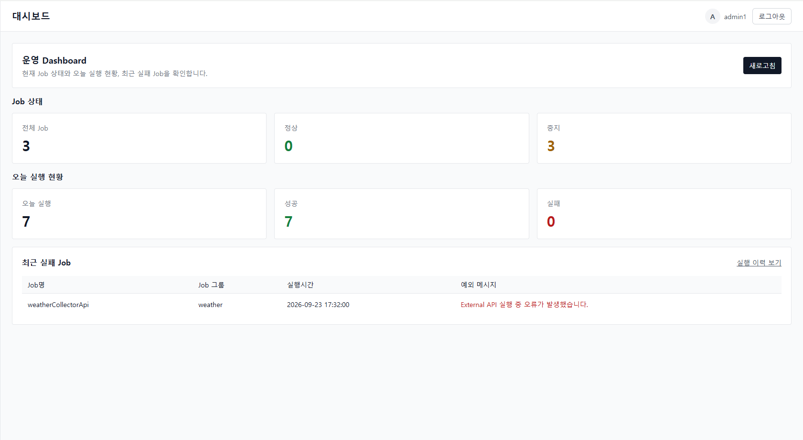
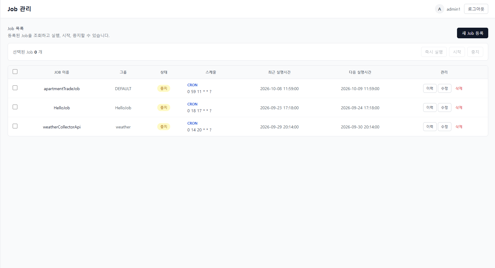
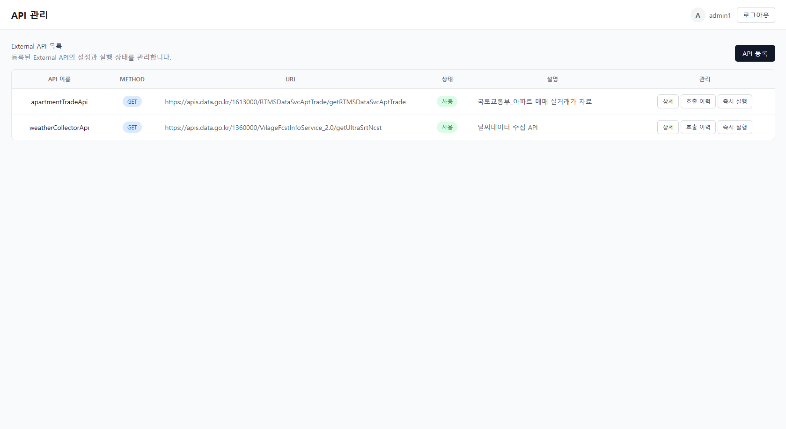

# Scheduler UI

Quartz 기반 동적 스케줄 관리 시스템의 관리자 웹 UI입니다.

Spring Boot 기반 Scheduler API와 연동하여 스케줄 등록·수정·실행 상태 조회와 외부 API 관리 기능을 제공합니다.

## 주요 기능

- Dashboard
- Job 등록 / 수정 / 삭제
- Job 중지 / 재개
- Job 실행 이력 조회
- 외부 API 등록 / 수정 / 삭제
- 외부 API 실행 및 호출 이력 조회
- 수집 데이터 조회
- 로그인 / 회원가입
- 회원가입 활성화 여부에 따른 UI 제어

## Tech Stack

- Vue 3
- Vite
- Vue Router
- Axios
- Tailwind CSS

## Backend

Backend repository:

- [spring-quartz-scheduler](https://github.com/ideale17/spring-quartz-scheduler)

## Screenshots

### Dashboard



### Job Management



### External API Management



## Project Setup

```bash
npm install
```

### Development

```bash
npm run dev
```

### Production Build

```bash
npm run build
```

### Lint

```bash
npm run lint
```
